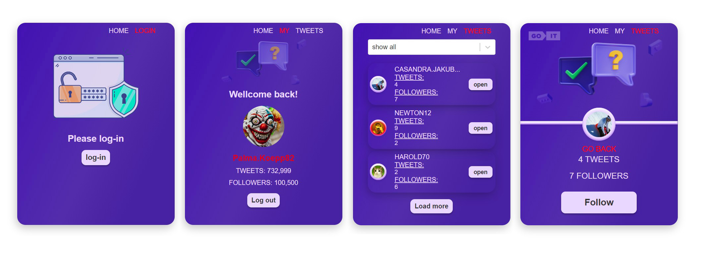

<!-- PROJECT LOGO -->

  <h3 align="center">Test task for Go-it</h3>

<!-- ABOUT THE PROJECT -->

## ℹ️ About The Project

The test task that I completed uses React, Redux, Redux-Thunks,
Styled-Components/System, React Router DOM and MockAPI. This project also
includes both public and private routes. Public routes are accessible to
all users, while private routes require authentication and can only be
accessed by logged-in users.

## 🌟 Show your support

Give a ⭐️ if this project helped you!

## 📝 License

Copyright © 2023 [Solod-S](https://www.linkedin.com/in/serhii-solod-557991256/).

<!-- CONTACT -->

## 👤 Contact

**Solod-S**

- LinkedIn: [@Solod_Sergey](https://www.linkedin.com/in/serhii-solod-557991256/)
- Github: [@Solod-S](https://github.com/Solod-S)
